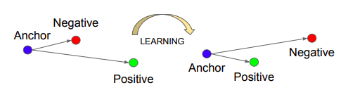

# metric_learning_siamese_triplet_loss

A triplet network takes in three images as input i.e., an anchor image, a positive image (i.e., image having label same as the anchor) and a negative image (i.e., image having label different from the anchor).  

