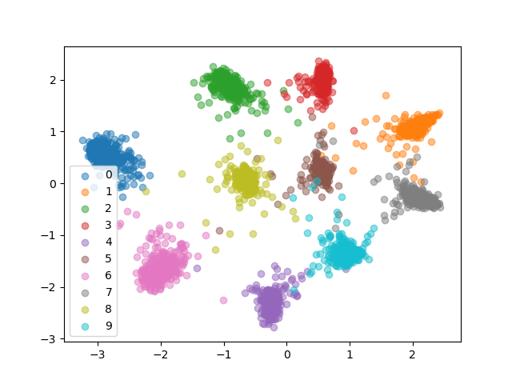
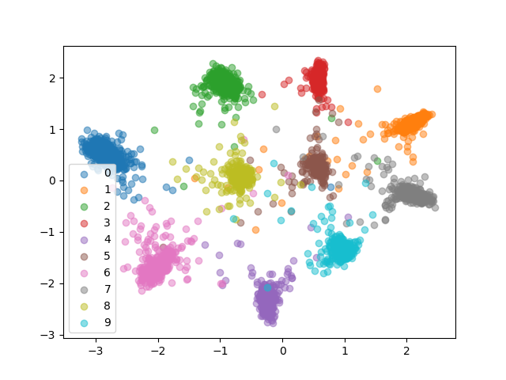
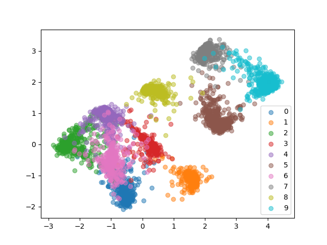
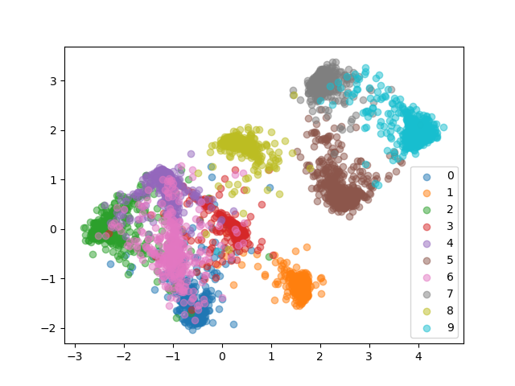

# metric_learning_siamese_triplet_loss

A triplet network takes in three images as input i.e., an anchor image, a positive image (i.e., image having label same as the anchor) and a negative image (i.e., image having label different from the anchor). The objective here is to learn embeddings such that the positive images are closer to the anchor as compared to the negative images. The same can be pictorically represented using the image given below:  

  

Source: Schroff, Florian, Dmitry Kalenichenko, and James Philbin. Facenet: A unified embedding for face recognition and clustering. CVPR 2015  

Moreover, the triplet loss is mathematically expressed as: 

  

The embeddings obtained for the MNIST dataset are as follows:  
For the MNIST Train Set: 
 
For the MNIST Test Set: 
 

The embeddings obtained for the FMNIST dataset are as follows:  
For the FMNIST Train Set: 
 
For the FMNIST Test Set: 
 

As it is evident from the above results, the embeddings obtained for different classes are separable clearly in MNIST but not so much in FMNIST, the reason being that the classes in FMNIST are not very different as in MNIST and also, training has been done by choosing random combinations of triplets (i.e., it is highly probable that the network has seen the easy samples quite a lot and did not see the hard samples otherwise it would have learned better). Random selection of triplets for training is not the right way to train, hence in literature a modification of this technique is used called as "Online Triplet Loss" with "Batch All" and "Batch Hard" strategy.
