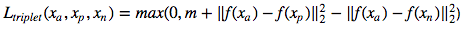

# metric_learning_siamese_triplet_loss

A triplet network takes in three images as input i.e., an anchor image, a positive image (i.e., image having label same as the anchor) and a negative image (i.e., image having label different from the anchor). The objective here is to learn embeddings such that the positive images are closer to the anchor as compared to the negative images. The same can be pictorically represented using the image given below:  

  

Source: Schroff, Florian, Dmitry Kalenichenko, and James Philbin. Facenet: A unified embedding for face recognition and clustering. CVPR 2015  

Moreover, the triplet loss is mathematically expressed as: 

  
